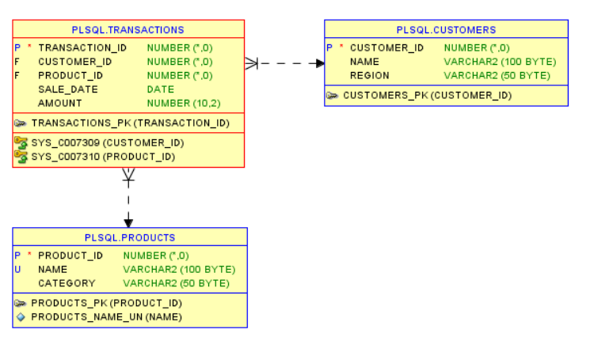

## 1. Problem Definition

- **Business Context:**
    - Type: E-commerce retail company, operating in Rwanda.
    - Department: Sales &  Marketing department, analyzing customer purchasing behavior    across regions/districts in Rwanda.
    - Industry: Online retail (e.g., electronics, fashion, or groceries)
- **Data Challenge**
    
    The company wants to understand which products perform best in different regions and how customer behavior evolves over time. They need insights to improve marketing and inventory decisions.
    
- **Expected Outcome**
    
    By using **PL/SQL window functions**, the company will uncover:
    
    - Top-selling products per region/district in Rwanda.
    - track monthly sales trends
    - Customer segmentation by spending
    - analyze growth rates

## 2. Success Criteria

- **Top 5 products per region/quarter** → Using `RANK()`

> This function helps to **rank products** based on sales within specific categories like region and quarter, identifying top performers.
> 
- **Running monthly sales totals** → Using `SUM() OVER()`

> This function is used to calculate **running totals of sales** month-over-month, showing cumulative progress throughout the year.
> 
- **Month-over-month growth percentage** → Using `LAG()`

> These functions facilitate the measurement of **month-over-month growth**, highlighting performance trends and the impact of business initiatives.
>

<!--       -->

