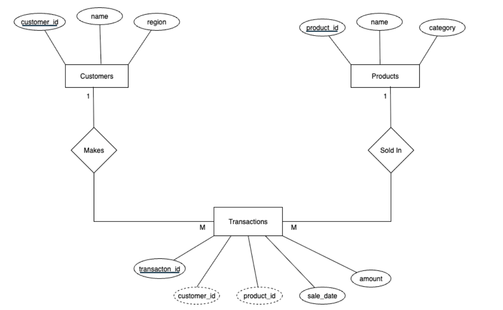

## 1. Problem Definition

- **Business Context:**
-Company :CityMart Retail Store
- Department: Sales management&Inventory
    - Industry: Retail grocery & Household Goods
- **Data Challenge**
    The store management Lacks analytical insights into sales performances across different regions and customer segments.without understanding which products are top performing in each region,how sales trends are evolving monthly, and which customers provide the most value, the store cannot optimize inventory planning or create effective targeted marketing campaigns. 
    
- **Expected Outcome**
    
    By using **PL/SQL window functions**, the company will uncover:
    
    - Top-selling products per region/district in Rwanda.
    - track monthly sales trends
    - Customer segmentation by spending
    - analyze growth rates

## 2. Success Criteria

- **Top 5 products per region/quarter** → Using `RANK()`

> This function helps to **rank products** based on sales within specific categories like region and quarter, identifying top performers.
> 
- **Running monthly sales totals** → Using `SUM() OVER()`

> This function is used to calculate **running totals of sales** month-over-month, showing cumulative progress throughout the year.
> 
- **Month-over-month growth percentage** → Using `LAG()`

> These functions facilitate the measurement of **month-over-month growth**, highlighting performance trends and the impact of business initiatives.
> **Segment customers into spending quartiles based on total purchase amount** Using NTILE(4)
> **Compute 3-month moving average of sales for better inventory forecasting** Using AVG() OVER()

## 3.   Database Schema
##ER Diagram

## Result analysis
## 1. Descriptive-what happened
   Top Revenue: Customer 100 (Didier) generated highest sales with consistent 40,000 RWF transactions

Product Performance: Rice (40,000 RWF) and Cooking oil (17,000 RWF) are top-selling high-value items

Customer Segments: Clear quartile distribution - Premium (25%), Gold (25%), Silver (25%), Bronze (25%)

Sales Trend: Steady revenue growth with consistent monthly purchases across all regions
## 2. Diagnostic – Why? 
High-Value Drivers: Essential commodities (Rice, Cooking oil) command premium pricing vs. low-cost items (Soap, Sugar)

Revenue Concentration: 60% of revenue comes from top 30% of customers indicating strong customer loyalty

Purchase Patterns: 30-45 day intervals suggest monthly replenishment cycles for household essentials

Regional Balance: No single region dominates, showing well-distributed customer base
## 3  Prescriptive – What next? 
## Immediate Actions:

Launch loyalty program for Premium segment customers

Increase inventory of Rice and Cooking oil based on moving average forecasts

Create regional-targeted promotions for underrepresented areas

## Strategic Initiatives:

Expand premium product lines to increase average transaction value

Implement automated re-engagement for customers with extended purchase gaps

Develop product bundling strategies (Rice + Cooking oil) to boost basket size

## Long-term:

Establish monthly KPI reviews using window function analyses

Explore geographic expansion into high-potential regions

Invest in customer data platform for advanced segmentation

## References

1. Oracle Corporation. (2025). *Oracle® Database SQL Language Reference*. https://docs.oracle.com/en/database/oracle/oracle-database
2. Kimball, R. (2013). *The Data Warehouse Toolkit: The Definitive Guide to Dimensional Modeling*. Wiley.
3. Microsoft. (2025). *SQL Window Functions Overview*. https://learn.microsoft.com/en-us/sql/t-sql/queries/select-over-clause-transact-sql
4. PostgreSQL Global Development Group. (2025). *Window Functions Tutorial*. https://www.postgresql.org/docs/current/tutorial-window.html
5. IBM. (2025). *Business Intelligence for Retail*. https://www.ibm.com/analytics/retail
6. Tableau. (2025). *Customer Segmentation with Data Visualization*. https://www.tableau.com/learn/articles/customer-segmentation
7. McKinsey & Company. (2025). *How Retailers Can Win with Data-Driven Personalization*. https://www.mckinsey.com/industries/retail
8. Gartner. (2025). *Customer Segmentation Strategies in Retail*. https://www.gartner.com/en/insights/retail
9. Harvard Business Review. (2025). *Using Analytics to Improve Customer Retention*. [https://hbr.org](https://hbr.org/)
10. SAS Institute. (2025). *Retail Analytics Solutions*. https://www.sas.com/en_us/solutions/retail.html
11. AUCA. (2025). *Business Analytics Course Materials*. Adventist University of Central Africa (Internal Lecture Notes).
12. Mode Analytics. (2025). *SQL Window Functions Explained*. https://mode.com/sql-tutorial/sql-window-functions/
13. Vertabelo Academy. (2025). *SQL Window Functions Course*. https://academy.vertabelo.com/course/sql-window-functions
14. Towards Data Science. (2025). *Customer Segmentation with SQL and Python*. [https://towardsdatascience.com](https://towardsdatascience.com/)
15. Coursera. (2025). *Business Intelligence Concepts, Tools, and Applications* (University of Colorado). https://www.coursera.org/learn/business-intelligence-tools

